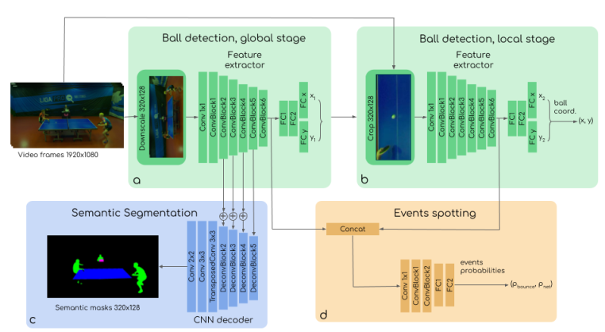
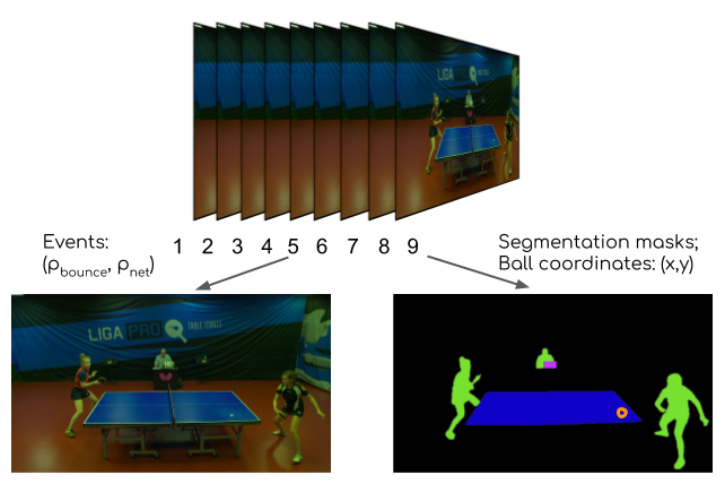

# TTNet-Pytorch

[![python-image]][python-url]
[![pytorch-image]][pytorch-url]

The implementation for the paper _**"TTNet: Real-time temporal and spatial video analysis of table tennis"**_ <br>
An introduction of the project could be found [here (from the authors)](https://medium.com/@osai.ai/osai-empowered-russian-table-tennis-championship-with-cv-and-ai-analytics-e7d52a6d8a5c)

---

## Demo


## 1. Features
- [x] Ball detection global stage
- [x] Ball detection local stage (refinement)
- [x] Events Spotting detection (Bounce and Net hit)
- [x] Semantic Segmentation (Human, table, and scoreboard)
- [x] [Multi-Task learning](https://arxiv.org/pdf/1705.07115.pdf)
- [x] [Distributed Data Parallel Training](https://github.com/pytorch/examples/tree/master/distributed/ddp)
- [x] Enable/Disable modules in the TTNet model
- [x] Smooth labeling for event spotting
- [x] TensorboardX

- **(Update 2020.06.23)**: Training much faster, achieve _**> 120 FPS**_ in the inference phase on a single 
GPU (GTX1080Ti). <br>

- **(Update 2020.07.03)**: The implementation could achieve comparative results with the reported results in the TTNet paper. <br>

- **(Update 2020.07.06)**: There are several limitations of the TTNet Paper (hints: Loss function, input size, and 2 more). I have implemented the task with a new 
approach and a new model. Now the new model could achieve:
  - `>` **130FPS** inference, 
  - **~0.96** IoU score for the segmentation task
  - `<` **4 pixels** (in the full HD resolution *(1920x1080)*) of Root Mean Square Error (RMSE) for the ball detection task<br>
  - **~97%** percentage of correction events **(PCE)** and smooth PCE **(SPCE)**.
  

## 2. Getting Started
### Requirement

```shell script
pip install -U -r requirement.txt
```

Other instruction for setting up virtual environments is [here](https://github.com/maudzung/virtual_environment_python3)

### 2.1. Preparing the dataset
The instruction for the dataset preparation is [here](./prepare_dataset/README.md)

### 2.2. Model & Input tensors

**TTNet model architecture**:



**Input tensor structure**



### 2.3. How to run

#### 2.3.1. Training
##### 2.3.1.1. Single machine, single gpu

```shell script
python main.py --gpu_idx 0
```

By default (as the above command), there are 4 modules in the TTNet model: *global stage, local stage, event spotting, segmentation*.
You can disable one of the modules, except the global stage module.<br>
An important note is if you disable the local stage module, the event spotting module will be also disabled.

- You can disable the _**segmentation stage**_:

```shell script
python main.py --gpu_idx 0 --no_seg
```

- You can disable the _**event spotting module**_:

```shell script
python main.py --gpu_idx 0 --no_event
```

- You can disable the _**local stage, event spotting, segmentation modules**_:

```shell script
python main.py --gpu_idx 0 --no_local --no_seg --no_event
```

##### 2.3.1.2. Multi-processing Distributed Data Parallel Training
We should always use the `nccl` backend for multi-processing distributed training since it currently provides the best 
distributed training performance.

- **Single machine (node), multiple GPUs**

```shell script
python main.py --dist-url 'tcp://127.0.0.1:29500' --dist-backend 'nccl' --multiprocessing-distributed --world-size 1 --rank 0
```

- **Two machines (two nodes), multiple GPUs**

_**First machine**_

```shell script
python main.py --dist-url 'tcp://IP_OF_NODE1:FREEPORT' --dist-backend 'nccl' --multiprocessing-distributed --world-size 2 --rank 0
```
_**Second machine**_

```shell script
python main.py --dist-url 'tcp://IP_OF_NODE2:FREEPORT' --dist-backend 'nccl' --multiprocessing-distributed --world-size 2 --rank 1
```

#### 2.3.2. Training stratergy

The performance of the TTNet strongly depends on the global stage for ball detection. Hence, It's necessary to train the 
`global ball stage module` of the TTNet model first.

- **1st phase**: Train the global and segmentation modules with 30 epochs
 
```shell script
./train_1st_phase.sh
```  

- **2nd phase**: Load the trained weights to the global and the segmentation part, initialize the weight of the local stage with the weights of
the global stage. In this phase, we train and just update weights of the local and the event modules. (30 epochs)

```shell script
./train_2nd_phase.sh
```

- **3rd phase**: Fine tune all modules. Train the network with only 30 epochs

```shell script
./train_3rd_phase.sh
```

  
#### 2.3.3. Visualizing training progress
The Tensorboard was used to save loss values on the training set and the validation set.
Execute the below command on the working terminal:
```
    cd logs/<task directory>/tensorboard/
    tensorboard --logdir=./
```

Then open the web browser and go to: [http://localhost:6006/](http://localhost:6006/)


#### 2.3.4. Evaluation

The thresholds of the segmentation and event spotting tasks could be set in `test.sh` bash shell scripts.

```shell script
./test_3rd_phase.sh
```

#### 2.3.5. Demo:

Run a demonstration with an input video:

```shell script
./demo.sh
```

## Contact

If you think this work is useful, please give me a star!
If you find any errors or have any suggestions, please contact me. Thank you!

**Email:** `nguyenmaudung93.kstn@gmail.com`

## Citation

```bash
@article{TTNet,
  author = {Roman Voeikov, Nikolay Falaleev, Ruslan Baikulov},
  title = {TTNet: Real-time temporal and spatial video analysis of table tennis},
  year = {2020},
  conference = {CVPR 2020},
}
```

## Usage
```
usage: main.py [-h] [--seed SEED] [--saved_fn FN] [-a ARCH] [--dropout_p P]
               [--multitask_learning] [--no_local] [--no_event] [--no_seg]
               [--pretrained_path PATH] [--overwrite_global_2_local]
               [--no-val] [--no-test] [--val-size VAL_SIZE]
               [--smooth-labelling] [--num_samples NUM_SAMPLES]
               [--num_workers NUM_WORKERS] [--batch_size BATCH_SIZE]
               [--print_freq N] [--checkpoint_freq N] [--sigma SIGMA]
               [--thresh_ball_pos_mask THRESH] [--start_epoch N]
               [--num_epochs N] [--lr LR] [--minimum_lr MIN_LR] [--momentum M]
               [-wd WD] [--optimizer_type OPTIMIZER] [--lr_type SCHEDULER]
               [--lr_factor FACTOR] [--lr_step_size STEP_SIZE]
               [--lr_patience N] [--earlystop_patience N] [--freeze_global]
               [--freeze_local] [--freeze_event] [--freeze_seg]
               [--bce_weight BCE_WEIGHT] [--global_weight GLOBAL_WEIGHT]
               [--local_weight LOCAL_WEIGHT] [--event_weight EVENT_WEIGHT]
               [--seg_weight SEG_WEIGHT] [--world-size N] [--rank N]
               [--dist-url DIST_URL] [--dist-backend DIST_BACKEND]
               [--gpu_idx GPU_IDX] [--no_cuda] [--multiprocessing-distributed]
               [--evaluate] [--resume_path PATH] [--use_best_checkpoint]
               [--seg_thresh SEG_THRESH] [--event_thresh EVENT_THRESH]
               [--save_test_output] [--video_path PATH] [--output_format PATH]
               [--show_image] [--save_demo_output]

TTNet Implementation

optional arguments:
  -h, --help            show this help message and exit
  --seed SEED           re-produce the results with seed random
  --saved_fn FN         The name using for saving logs, models,...
  -a ARCH, --arch ARCH  The name of the model architecture
  --dropout_p P         The dropout probability of the model
  --multitask_learning  If true, the weights of different losses will be
                        learnt (train).If false, a regular sum of different
                        losses will be applied
  --no_local            If true, no local stage for ball detection.
  --no_event            If true, no event spotting detection.
  --no_seg              If true, no segmentation module.
  --pretrained_path PATH
                        the path of the pretrained checkpoint
  --overwrite_global_2_local
                        If true, the weights of the local stage will be
                        overwritten by the global stage.
  --no-val              If true, use all data for training, no validation set
  --no-test             If true, dont evaluate the model on the test set
  --val-size VAL_SIZE   The size of validation set
  --smooth-labelling    If true, smoothly make the labels of event spotting
  --num_samples NUM_SAMPLES
                        Take a subset of the dataset to run and debug
  --num_workers NUM_WORKERS
                        Number of threads for loading data
  --batch_size BATCH_SIZE
                        mini-batch size (default: 16), this is the totalbatch
                        size of all GPUs on the current node when usingData
                        Parallel or Distributed Data Parallel
  --print_freq N        print frequency (default: 10)
  --checkpoint_freq N   frequency of saving checkpoints (default: 3)
  --sigma SIGMA         standard deviation of the 1D Gaussian for the ball
                        position target
  --thresh_ball_pos_mask THRESH
                        the lower thresh for the 1D Gaussian of the ball
                        position target
  --start_epoch N       the starting epoch
  --num_epochs N        number of total epochs to run
  --lr LR               initial learning rate
  --minimum_lr MIN_LR   minimum learning rate during training
  --momentum M          momentum
  -wd WD, --weight_decay WD
                        weight decay (default: 1e-6)
  --optimizer_type OPTIMIZER
                        the type of optimizer, it can be sgd or adam
  --lr_type SCHEDULER   the type of the learning rate scheduler (steplr or
                        ReduceonPlateau)
  --lr_factor FACTOR    reduce the learning rate with this factor
  --lr_step_size STEP_SIZE
                        step_size of the learning rate when using steplr
                        scheduler
  --lr_patience N       patience of the learning rate when using
                        ReduceoPlateau scheduler
  --earlystop_patience N
                        Early stopping the training process if performance is
                        not improved within this value
  --freeze_global       If true, no update/train weights for the global stage
                        of ball detection.
  --freeze_local        If true, no update/train weights for the local stage
                        of ball detection.
  --freeze_event        If true, no update/train weights for the event module.
  --freeze_seg          If true, no update/train weights for the segmentation
                        module.
  --bce_weight BCE_WEIGHT
                        The weight of BCE loss in segmentation module, the
                        dice_loss weight = 1- bce_weight
  --global_weight GLOBAL_WEIGHT
                        The weight of loss of the global stage for ball
                        detection
  --local_weight LOCAL_WEIGHT
                        The weight of loss of the local stage for ball
                        detection
  --event_weight EVENT_WEIGHT
                        The weight of loss of the event spotting module
  --seg_weight SEG_WEIGHT
                        The weight of BCE loss in segmentation module
  --world-size N        number of nodes for distributed training
  --rank N              node rank for distributed training
  --dist-url DIST_URL   url used to set up distributed training
  --dist-backend DIST_BACKEND
                        distributed backend
  --gpu_idx GPU_IDX     GPU index to use.
  --no_cuda             If true, cuda is not used.
  --multiprocessing-distributed
                        Use multi-processing distributed training to launch N
                        processes per node, which has N GPUs. This is the
                        fastest way to use PyTorch for either single node or
                        multi node data parallel training
  --evaluate            only evaluate the model, not training
  --resume_path PATH    the path of the resumed checkpoint
  --use_best_checkpoint
                        If true, choose the best model on val set, otherwise
                        choose the last model
  --seg_thresh SEG_THRESH
                        threshold of the segmentation output
  --event_thresh EVENT_THRESH
                        threshold of the event spotting output
  --save_test_output    If true, the image of testing phase will be saved
  --video_path PATH     the path of the video that needs to demo
  --output_format PATH  the type of the demo output
  --show_image          If true, show the image during demostration
  --save_demo_output    If true, the image of demonstration phase will be
                        saved
```

[python-image]: https://img.shields.io/badge/Python-3.6-ff69b4.svg
[python-url]: https://www.python.org/
[pytorch-image]: https://img.shields.io/badge/PyTorch-1.5-2BAF2B.svg
[pytorch-url]: https://pytorch.org/
